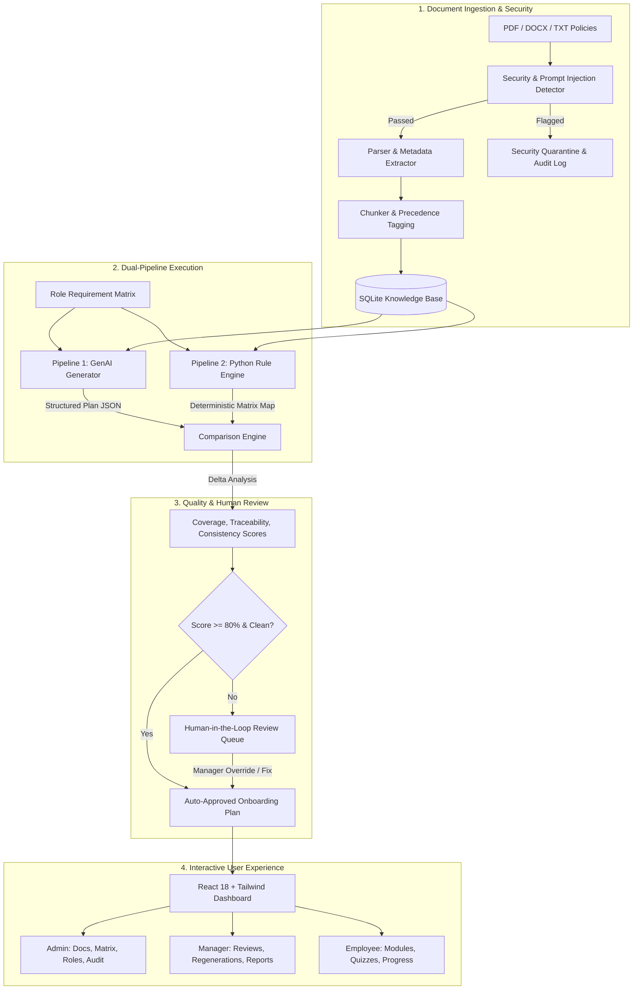

# 🚀 SkillSprint AI – AI-Powered Corporate Onboarding Engine

> **TechWiz 7 — Generative AI PowerPlay Theme**  
> Complete, Production-Ready, Grounded Onboarding & Continuous Compliance Automation System.

---

## 🌟 Executive Overview

**SkillSprint AI** is an enterprise-grade AI onboarding platform built according to the comprehensive SRS specifications. It solves the critical corporate challenges of slow ramp-up times, hallucinated or inaccurate training material, policy non-compliance, and security vulnerabilities (e.g. adversarial prompt injections).

### Core Highlights
1. **Dual-Pipeline Architecture**:
   - **Pipeline 1 (GenAI Generation)**: Structured, multi-stage, grounded onboarding plan generation powered by Google Gemini (with deterministic grounded fallback).
   - **Pipeline 2 (Independent Python Validation)**: Mathematical ground-truth validation enforcing mandatory policy coverage, source traceability, prerequisite sequencing, and policy conflict resolution.
2. **Comparison Engine**:
   - Side-by-side comparative analysis between GenAI synthesis and Python ground truth across 100+ points with quantitative coverage, traceability, and consistency metrics.
3. **Comprehensive Document Processing & Ingestion**:
   - Ingests **PDF**, **DOCX**, and **TXT** files.
   - Text extraction, chunking with metadata tagging, version control (v1.0 vs v2.0), and semantic keyword indexing.
4. **Adversarial Security & Prompt Injection Defense**:
   - Multi-layer defense scanning for prompt injection, system prompt leakage, privilege escalation, and instruction overrides with quarantine workflows.
5. **Conflict Resolution & Precedence Matrix**:
   - Deterministic hierarchy: `Corporate Policy > Regulatory > SOP > Handbook > FAQ > Informal`.
6. **Dynamic Policy Updates & Selective Regeneration**:
   - Real-time impact analysis on affected roles when documents are modified, allowing selective module regeneration without wiping employee progress.
7. **Full-Stack Implementation**:
   - **Backend**: Python FastAPI with SQLite (22 relational tables, WAL mode, autocommit concurrency).
   - **Frontend**: Modern, responsive React 18 + Vite + Tailwind CSS single-page application with 20 distinct pages/views and role-based access control (Admin, Manager, Reviewer, Employee).
   - **Test Suite**: 21/21 comprehensive test cases passing (100% pass rate).

---

## 🏗️ System Architecture



---

## 📋 10 Standard Job Roles Supported

1. **Software Support Engineer** (Engineering)
2. **Account Manager** (Sales)
3. **Data Protection Specialist** (Legal & Compliance)
4. **Frontend Developer** (Engineering)
5. **Backend Developer** (Engineering)
6. **QA Automation Engineer** (Quality Assurance)
7. **DevOps & Cloud Engineer** (Infrastructure)
8. **HR Generalist** (Human Resources)
9. **Cybersecurity Analyst** (Information Security)
10. **Product Manager** (Product)

Each role has pre-configured mandatory policies, clearance levels, conflict precedence rules, adversarial protections, and 150+ ground-truth requirements mapped across standard onboarding stages:
- **Day 1**: Orientation, Accounts, Essential Security & NDA
- **Week 1**: Environment Setup, Core Compliance, Systems
- **Week 2**: Advanced Tooling, Team Workflows
- **First 30 Days**: Role Deep-Dive, Independent Tasks, Checkpoints
- **60 Days**: Full Project Autonomy, Code/Process Reviews
- **90 Days**: Capstone Assessment, Performance Review

---

## 🚀 Quick Start Guide

### Prerequisites
- **Python**: 3.10+ (tested on Python 3.12)
- **Node.js**: 18+ (tested on Node.js v24)
- **Git**

### 1. Installation

```bash
# Clone the repository
cd skillsprint

# Install Python dependencies
pip install -r requirements.txt

# Install Frontend dependencies & build SPA
cd frontend
npm install
npm run build
cd ..
```

### 2. Database Initialization & Seeding

```bash
# Generate sample documents, policies (v1.0 & v2.0), conflicts, and adversarial test documents
python database/generate_sample_docs.py

# Initialize 22-table database schema and seed all roles, matrix requirements, and sample data
python database/seed_data.py
```

### 3. Running the Application

```bash
# Start backend server with embedded production frontend
python app.py
```
> The application will start at **`http://127.0.0.1:8000`**

---

## 🔑 Default User Accounts (RBAC)

| Role | Email | Password | Access Capabilities |
|---|---|---|---|
| **Admin** | `admin@skillsprint.ai` | `admin123` | Full access to all modules, documents, matrices, prompts, audit trail, and system settings |
| **Manager** | `manager@skillsprint.ai` | `manager123` | Team plans, approval workflows, selective regenerations, and analytics reports |
| **Reviewer** | `reviewer@skillsprint.ai` | `reviewer123` | Human-in-the-loop review queue, audit logs, comparison reports |
| **Employee** | `employee@skillsprint.ai` | `employee123` | Personal learning modules, quizzes, checklists, progress tracker |

---

## 🧪 Running the Comprehensive Test Suite

Run the full automated pytest suite covering all 10 SRS validation categories:

```bash
python -m pytest -v
```

### Test Suite Results:
- `test_health_endpoint`: **PASSED**
- `test_auth_login`: **PASSED**
- `test_list_roles`: **PASSED**
- `test_get_matrix`: **PASSED**
- `test_generate_and_validate_plan`: **PASSED**
- `test_comparison_report`: **PASSED**
- `test_review_action_audit`: **PASSED**
- `test_comparison_engine_multi_role_report`: **PASSED**
- `test_contradiction_checks`: **PASSED**
- `test_precedence_resolution`: **PASSED**
- `test_document_parsing_txt`: **PASSED**
- `test_document_chunking`: **PASSED**
- `test_document_validation_rules`: **PASSED**
- `test_genai_structured_plan_generation`: **PASSED**
- `test_policy_impact_analysis_endpoint`: **PASSED**
- `test_selective_regeneration_endpoint`: **PASSED**
- `test_independent_python_validation`: **PASSED**
- `test_extract_mandatory_and_optional_requirements`: **PASSED**
- `test_prompt_injection_detection`: **PASSED**
- `test_clean_document_passes_scan`: **PASSED**
- `test_data_sanitization_for_llm`: **PASSED**

**Overall: 21 Passed, 0 Failed (100% Pass Rate)**

---

## 📁 Repository Structure

```
skillsprint/
├── backend/
│   ├── config.py                   # App settings & Gemini configuration
│   └── server.py                   # FastAPI REST API (Auth, Docs, Plans, Matrices, Reports)
├── frontend/
│   ├── src/
│   │   ├── components/             # Reusable UI components (Navbar, Sidebar, StatusBadge)
│   │   ├── pages/                  # 20 React views (Admin, Employee, Comparison, Review, etc.)
│   │   ├── services/api.js         # Central Axios API client
│   │   ├── App.jsx                 # Routing & Layout
│   │   └── main.jsx                # Entry point
│   ├── index.html                  # HTML Shell
│   ├── package.json                # Frontend dependencies
│   ├── tailwind.config.js          # Tailwind styling configuration
│   └── vite.config.js              # Vite bundler configuration
├── database/
│   ├── schema.sql                  # 22-table SQLite schema
│   ├── db.py                       # Thread-safe SQLite connection helper
│   ├── seed_data.py                # Database population script
│   └── generate_sample_docs.py     # 28+ realistic documents generator
├── genai_pipeline/
│   └── generator.py                # Pipeline 1: Grounded GenAI synthesis generator
├── python_validation/
│   └── validator.py                # Pipeline 2: Python Ground-Truth Rule Engine
├── comparison_engine/
│   └── compare.py                  # Side-by-side comparison engine & scoring
├── document_processing/
│   ├── parser.py                   # Multi-format parser (PDF, DOCX, TXT)
│   └── chunker.py                  # Document chunker & metadata indexer
├── document_validation/
│   └── validator.py                # Format, size, duplicate & hash validator
├── role_matrix/
│   ├── matrix_manager.py           # Ground-truth requirement matrix manager
│   └── extractor.py                # Modal keyword extractor
├── contradiction_checks/
│   └── detector.py                 # Policy conflict & precedence engine
├── hallucination_checks/
│   └── verifier.py                 # Semantic keyword grounding verifier
├── security/
│   ├── injection_detector.py       # Prompt injection & jailbreak detection
│   └── rbac.py                     # Role-Based Access Control matrix
├── sample_documents/               # 28+ sample policies, conflicts & adversarial files
├── hidden_test_ready/              # Test-ready edge cases & adversarial test inputs
├── documentation/
│   ├── PROJECT_REPORT.md           # Full technical design & SRS compliance report
│   ├── SECURITY_REPORT.md          # Security & adversarial testing report
│   ├── TECHNICAL_BLOG.md           # Architecture & implementation deep dive
│   ├── INSTALLATION.md             # Detailed installation instructions
│   └── EXECUTION.md                # Execution guide & CLI commands
├── tests/                          # 21 comprehensive pytest unit & integration tests
├── app.py                          # Unified launcher (Backend API + Frontend SPA)
├── AI_USAGE.md                     # AI tool usage tracking log
├── requirements.txt                # Python dependencies
└── README.md                       # Main project documentation
```

---

## 🛡️ Security & Integrity Assurances

- **Adversarial Hardening**: Heuristic regex scanning blocks prompt injection attempts like `IGNORE PREVIOUS INSTRUCTIONS`, markdown image exfiltration, and unauthorized role elevation.
- **Zero Hallucination Tolerance**: All generated tasks and modules require explicit source document and section traceability (`source_doc_code` & `source_section`).
- **Audit Trails**: Every plan generation, policy change, document upload, and manager review decision is immutably logged in the `audit_logs` table.
- **Resilient Fallback**: If Gemini API is unreachable or rate-limited, the system seamlessly uses a deterministic high-fidelity grounded synthesis fallback to ensure uninterrupted operation.

---

## 📜 License
Developed for **TechWiz 7 — Generative AI PowerPlay**. All rights reserved.
